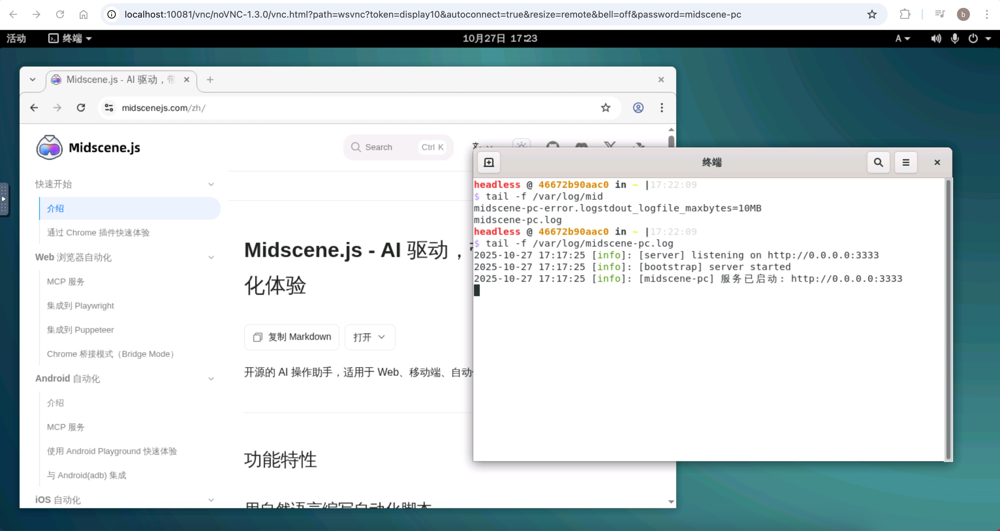
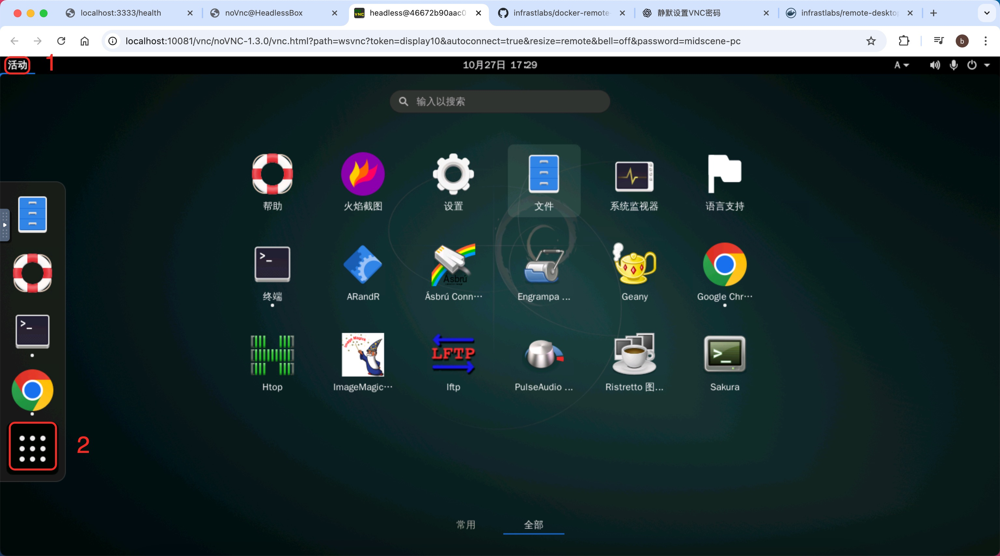

<div align="center">

# 🐳 Midscene PC Docker 容器

**基于 Ubuntu GNOME 桌面的 Docker 容器，预装了 Midscene PC 服务，支持通过 VNC 访问图形界面**

[](https://www.docker.com/)
[](https://ubuntu.com/)
[](https://www.realvnc.com/)

[📖 原始项目地址](https://github.com/infrastlabs/docker-remote-desktop) | [📚 Midscene PC 服务文档](https://github.com/mofangbao/midscene-pc)

</div>

---

## 📖 项目简介

本项目在原始项目基础上预装了以下组件：
- 🌐 **Chrome 浏览器**
- 🖥️ **支持文件夹右键打开的终端**
- 🤖 **Midscene PC 自动化服务**

<div align="center">



</div>

---

## 演示
### 查看资源占用（连接到远程服务）


[](https://github.com/user-attachments/assets/4b8260b3-b5c7-4ba5-bafa-a0a177703efa)

---

## ✨ 核心特性

| 特性 | 描述 |
|------|------|
| 🖥️ **Ubuntu GNOME 桌面环境** | 完整的图形界面体验 |
| 🚀 **Midscene PC 自动启动** | 使用 supervisor 进程管理器自动运行 |
| 🌐 **VNC 远程访问** | 通过浏览器或 VNC 客户端访问 |
| 🔍 **Chrome 浏览器** | 预装 Google Chrome 浏览器 |
| ⚡ **Node.js 环境** | 支持运行 JavaScript 应用程序 |

---

## 🚀 快速开始

### 📥 获取镜像

<details>
<summary><b>🔨 自行构建</b></summary>

```bash
git clone https://github.com/mofangbao/midscene-pc-docker.git
cd midscene-pc-docker
docker build -t ppagent/midscene-ubuntu-desktop:latest .
```

</details>

<details>
<summary><b>📦 从 Docker Hub 拉取</b></summary>

```bash
docker pull ppagent/midscene-ubuntu-desktop:latest
```

</details>

### 🏃‍♂️ 运行容器

#### 使用启动脚本（推荐）

```bash
# 使用提供的启动脚本
./start.sh
```

#### 暂不支持 docker-compose 运行

> ⚠️ **注意**: 目前暂不支持使用 docker-compose 运行

---

## 🔧 服务管理

### 📊 查看服务状态

```bash
# 查看进程
ps aux | grep midscene

# 查看日志
tail -f /var/log/midscene-pc.log
tail -f /var/log/midscene-pc-error.log
```

### 🎛️ 手动控制服务

```bash
# 通过 supervisor 管理
supervisorctl start midscene-pc
supervisorctl stop midscene-pc
supervisorctl restart midscene-pc

# 手动运行命令
npx midscene-pc
```

### 🆙 Midscene-pc 服务更新

```bash
# 在容器内更新到最新版本（临时更新）
npx midscene-pc@latest

# 更新后重启服务
supervisorctl restart midscene-pc
```

> [!IMPORTANT]
> ♻️ 永久更新需要重新编译镜像。

> [!IMPORTANT]
> 🕐 **启动提示**: 启动后需要等待约 10 秒钟初始化桌面，如果 VNC 连接出现黑屏，请稍等片刻。

---

## 🌐 端口配置

| 端口 | 服务 | 访问地址 |
|------|------|----------|
| **10081** | VNC Web 界面 | http://localhost:10081 |
| **3333** | Midscene PC 服务 | - |

---

## ❓ 常见问题

<details>
<summary><b>🔧 如何预装其他软件？</b></summary>

> 将需要预装的 deb 文件拷贝到 `software` 目录，然后重新编译镜像即可实现预装。
> 
> 📋 **已测试软件**: 微信、钉钉、VSCode、WPS 等常用软件均可正常运行。

</details>

<details>
<summary><b>🔐 VNC 的密码是什么？</b></summary>

如果没有在 `start.sh` 或自定义的 `docker run` 脚本中指定密码相关的环境变量，则使用默认密码 `headless`。

**可修改的环境变量**:
- `VNC_PASS`
- `VNC_PASS_RO` 
- `SSH_PASS`

**默认 start.sh 启动配置**:
```bash
SSH_PASS=midscene-pc
VNC_PASS=midscene-pc
VNC_PASS_RO=midscene_pc
```

</details>

<details>
<summary><b>📱 桌面应用在哪里？</b></summary>

1. 点击左上角的 **`活动`** 按钮
2. 出现收藏栏后，点击收藏栏的菜单按钮
3. 即可看到应用程序面板（dashboard）

<div align="center">



</div>

</details>

---

## ⚠️ 已知问题

| 平台 | 问题描述 | 影响范围 |
|------|----------|----------|
| 🍎 **macOS** | 创建 midscene-pc 设备时不支持手动圈画功能 | 全屏和固定区域功能正常 |
| 🍎 **macOS** | VNC 连接后无法自动适配 Retina 显示 | 不影响自动化操作功能 |
| 🐳 **Docker** | 暂时只支持 docker run 启动 | 不支持 docker-compose |
| 💾 **数据持久化** | 目前不支持完整的数据持久化，但可通过挂载外部目录到容器中使用 | 使用 `-v` 挂载外部目录以保留数据 |

---

<div align="center">

**🎉 感谢使用 Midscene PC Docker 容器！**

如有问题或建议，欢迎提交 [Issue](https://github.com/mofangbao/midscene-pc-docker/issues) 或 [Pull Request](https://github.com/mofangbao/midscene-pc-docker/pulls)

</div>
